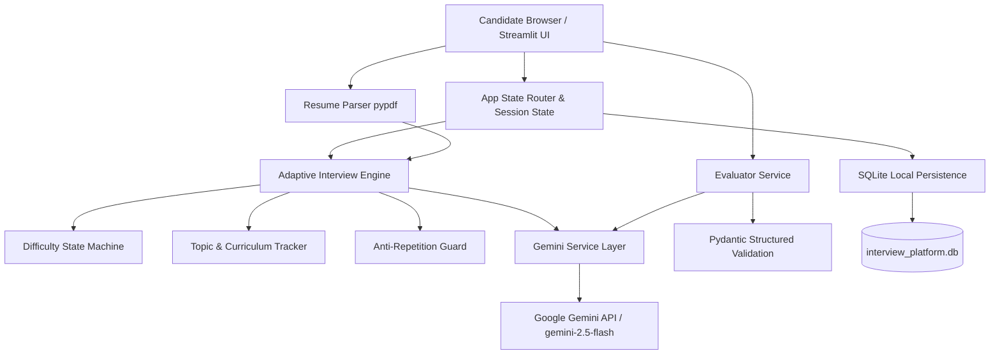

# Adaptive AI Interviewer

An autonomous, dynamic interview and technical assessment platform powered by the **Google Gemini API**, built with **Python**, **Streamlit**, **Pydantic**, and **SQLite**.

Unlike fixed question banks or generic chatbots, this platform observes candidate responses in real-time and dynamically adapts questions, difficulty, focus topics, and targeted follow-up probes.

---

## 🎯 Key Capabilities & Engineering Highlights

* **Adaptive Difficulty State Machine**: Controlled 3-level progression (`Easy` ↔ `Medium` ↔ `Hard`) that promotes on scores $\ge 8.0/10$, maintains on $5.0–7.9/10$, and steps down on $\le 4.9/10$, dampened by consecutive answer streaks to prevent erratic jumps.
* **Intelligent Topic Adaptation**: Tracks performance across core role curricula (e.g. System Design, Concurrency, Algorithms, ML, Statistics). Identifies missing concepts and intelligently revisits weak concepts from alternate practical angles.
* **Targeted Follow-Up Generation**: If a candidate provides a partially correct or high-level intuition answer, the interviewer challenges the specific missing nuance, trade-off, or failure mode without giving sycophantic praise.
* **Anti-Repetition Mechanism**: Tracks past session questions using lexical and keyword Jaccard overlap to ensure no question is repeated or trivially rephrased.
* **Structured Evaluation via Pydantic**: Every candidate response is parsed into a strict Pydantic schema containing numerical scores across correctness, depth, clarity, completeness, plus strengths, weaknesses, and missing concepts.
* **Resume Personalization (Optional PDF)**: Extracts key projects, languages, and technologies from uploaded PDF resumes to ground interview questions directly in the candidate's real experience.
* **Local SQLite Persistence**: Full interview transcripts, question timestamps, candidate answers, structured evaluations, and final diagnostic reports are preserved locally.
* **Zero GPU / Local LLM Requirement**: Runs cleanly and quickly on any standard laptop without external database servers or GPU instances.
* **Editorial & Minimalist Aesthetic**: A focused assessment environment free of noisy chatbot widgets, neon gradients, or artificial animations.

---

## 📐 Architecture



---

## 🛠️ Technology Stack

| Layer | Technology |
|---|---|
| **Language** | Python 3.10+ |
| **LLM Inference** | Google Gemini API (`gemini-2.5-flash`) via `google-genai` |
| **Structured Outputs** | Pydantic v2 |
| **Interface** | Streamlit (with minimalist editorial custom CSS) |
| **Database** | SQLite3 |
| **Resume Extraction** | PyPDF |
| **Configuration** | python-dotenv |

---

## 📂 Project Structure

```
LLM_sample_project/
├── .env.example              # Environment variable template
├── .gitignore                # Git ignore rules for secrets and DB
├── requirements.txt          # Pinned project dependencies
├── README.md                 # Architecture, setup, and usage documentation
├── interview_platform.db     # SQLite persistence file (auto-generated)
├── tests/
│   └── test_core_engine.py   # Unit tests for difficulty, repetition, and DB
└── app/
    ├── __init__.py
    ├── main.py               # Streamlit application entry point & router
    ├── config.py             # Global configurations, roles, and defaults
    ├── database/
    │   ├── __init__.py
    │   └── db.py             # SQLite CRUD for sessions, questions, answers, evaluations
    ├── models/
    │   ├── __init__.py
    │   ├── interview.py      # Session, Question, Answer, and State schemas
    │   └── evaluation.py     # AnswerEvaluation and FinalReport Pydantic schemas
    ├── prompts/
    │   ├── __init__.py
    │   ├── interviewer.py    # Question generation & follow-up prompt builders
    │   └── evaluator.py      # Evaluation and final diagnostic report builders
    ├── services/
    │   ├── __init__.py
    │   ├── gemini_service.py # Gemini client wrapper with structured JSON parsing
    │   ├── interview_engine.py# Core adaptive engine (difficulty, topic, anti-repetition)
    │   ├── evaluator.py      # Answer evaluation & executive report generator
    │   └── resume_parser.py  # PDF text and highlight extractor
    ├── ui/
    │   ├── __init__.py
    │   ├── styles.py         # Minimalist editorial custom CSS
    │   ├── views_home.py     # Session setup & resume upload
    │   ├── views_interview.py# Focused assessment screen & post-answer feedback
    │   ├── views_results.py  # Executive report with breakdown & study roadmap
    │   ├── views_history.py  # Previous session drawer & report inspector
    │   └── views_settings.py # API status, key configuration & test ping
    └── utils/
        ├── __init__.py
        └── helpers.py        # Anti-repetition matcher, score formatters, loggers
```

---

## ⚡ Quickstart & Installation

### 1. Prerequisites
- Python 3.10+ installed.

### 2. Clone or Navigate to Project
```bash
cd c:/projects/LLM_sample_project
```

### 3. Install Dependencies
```bash
pip install -r requirements.txt
```

### 4. Configure API Key
Copy `.env.example` to `.env`:
```bash
cp .env.example .env
```
Open `.env` and add your Google Gemini API key:
```ini
GEMINI_API_KEY=AIzaSy...your_gemini_api_key...
GEMINI_MODEL=gemini-2.5-flash
```
*(You can obtain a free Gemini API key from [Google AI Studio](https://aistudio.google.com/)).*

> **Note**: If no key is configured, the application automatically activates **Sandbox Mode**, allowing you to test the full adaptive lifecycle, UI, and database locally using deterministic mock evaluators.

### 5. Run Backend Verification Tests
```bash
python tests/test_core_engine.py
```

### 6. Launch the Application
```bash
streamlit run app/main.py
```
Open your browser at `http://localhost:8501`.

---

## 🧠 How the Adaptive Logic Works

### 1. Controlled Difficulty State Machine
Instead of allowing the LLM to arbitrarily jump across difficulty levels, the engine enforces a controlled state machine:
* **Score $\ge 8.0$**: Increases difficulty (`Easy` → `Medium` → `Hard`). Tracks consecutive high scores.
* **Score $5.0 - 7.9$**: Maintains current difficulty. Resets streaks.
* **Score $\le 4.9$**: Decreases difficulty (`Hard` → `Medium` → `Easy`). Tracks consecutive low scores.
* **Safeguards**: Never jumps directly from `Easy` to `Hard` in a single transition.

### 2. Topic & Concept Adaptation
* Each role has a tailored curriculum (e.g. Backend: *REST/gRPC*, *Database Sharding*, *Caching*, *Security*, *Message Queues*).
* If a candidate scores $< 6.0/10$ on a question and misses key technical concepts, the engine logs those `missing_concepts` and schedules that weak area to be probed from an alternate angle.

### 3. Targeted Follow-ups vs. Generic Praise
* If an answer demonstrates foundational knowledge but overlooks critical production constraints or trade-offs, `should_follow_up` is flagged as `True`.
* The interviewer immediately asks a surgical follow-up question directly addressing the gap rather than offering empty encouragement.

### 4. Anti-Repetition Filter
* Before presenting any generated question to the candidate, the engine compares it against all prior questions in the current session using:
  1. SequenceMatcher character-level similarity.
  2. Keyword set Jaccard coefficient after stop-word removal.
* If either metric exceeds the similarity threshold, the question is regenerated.

---

## 📊 Database Schema (SQLite)

The local SQLite database (`interview_platform.db`) maintains complete auditability:

* **`interviews`**: `id`, `role`, `experience`, `interview_type`, `difficulty_mode`, `total_questions`, `overall_score`, `completed`, `report_json`, `created_at`.
* **`questions`**: `id`, `interview_id`, `question_number`, `question_text`, `topic`, `difficulty`, `is_follow_up`, `target_concept`, `created_at`.
* **`answers`**: `id`, `interview_id`, `question_number`, `answer_text`, `submitted_at`.
* **`evaluations`**: `id`, `interview_id`, `question_number`, `overall_score`, `correctness`, `technical_depth`, `clarity`, `completeness`, `feedback_json`, `evaluated_at`.

---

## 🛡️ API Key Security & Best Practices

* The Gemini API key is loaded strictly through environment variables (`.env`) or runtime session memory.
* Sensitive key values are never rendered in full in the UI (masked as `AIza...xxxx`).
* `.env` and `.db` files are included in `.gitignore` to prevent accidental version control leaks.
* Structured generation uses JSON schema validation with fallback parsing to ensure stability even under unexpected API responses.

---

## 🚀 Future Roadmap

* Audio question read-out and speech-to-text voice input via Web Speech API.
* Live code execution sandbox for algorithmic programming questions.
* Comparative percentile scoring against historical candidate benchmarks.
